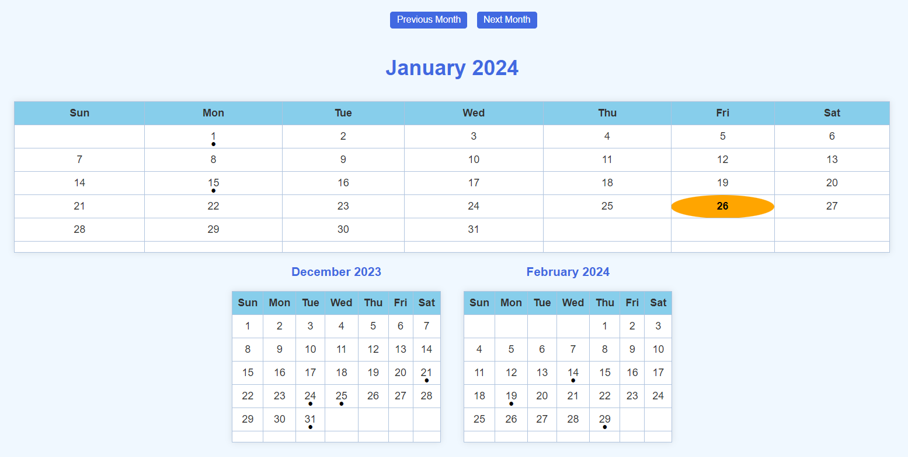

    <h1>JavaScript Calendar</h1>

 

    

 

#### Overview:

Explore the Interactive JavaScript Calendar, a dynamic and engaging project. This calendar not only dynamically adjusts to the current month and year but also highlights holidays and observances, making it both functional and visually appealing. Discover the convenience of tooltips that provide additional information when you hover over highlighted dates.

The program will be an ongoing project, and I'll continue to incorporate new elements over time.

#### Try it Out:

Experience the calendar in action by visiting the live demo [here](https://webpages.charlotte.edu/jvang29/JavaScript-Calendar/index.html).

#### Getting Started:

1. Clone the repository to your local machine one of the following:

   HTTPS: <pre><code>git clone https://github.com/jvang0620/Calendar</code></pre>
   SSH: <pre><code>git clone https://github.com/jvang0620/Calendar</code></pre>

2. Add extension "Live Server" if you havn't:

    

 

3. Next, right-click anywhere in the HTML file and select "Open with Live Server", and the app will display on your local machine.

You're all set. Happy coding!!!:)
