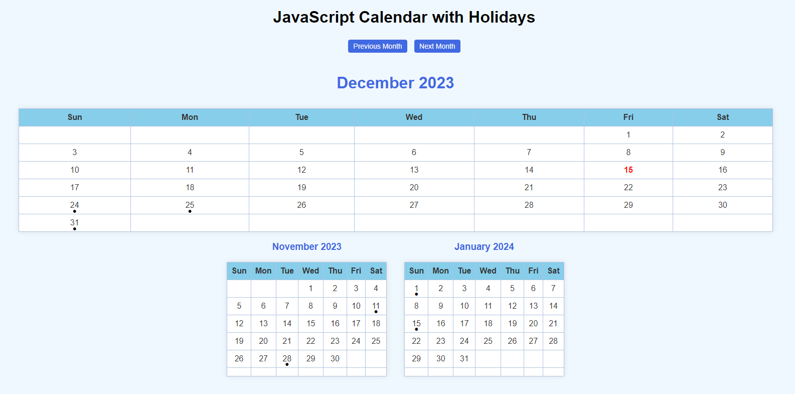
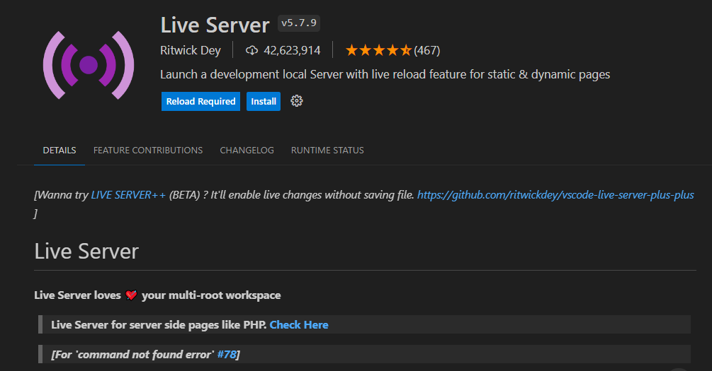

<h1 align="center">A JavaScript Calendar</h1>

<br>

<div align="center">
    
</div>

<br>

This project is a fun way for me to enhance my HTML, CSS, and JavaScript skills. Feel free to clone and use the code, adding any features you'd like. The program will be an ongoing project, and I'll continue to incorporate new elements over time.

<br>

```bash
git clone https://github.com/jvang0620/JavaScript-Calendar
```

Add extension "Live Server" if you havn't:

<div align="center">
    
</div>

<br>

Next, right-click anywhere in the HTML file and select "Open with Live Server", and the app will display on your local machine.

You're all set.

Happy coding!!!:)
